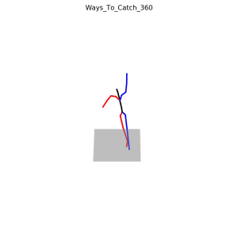
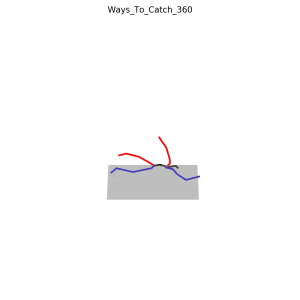
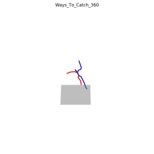

# Motion-X-to-HumanML3D

**pipline** ：Motion-X(npy) $\rightarrow$ AMASS(npz) $\rightarrow$ HumanML3D(npy)

**Transition Matrix Testing**: Based on the results, the transition matrix `trans_matrix` is only used to adjust the overall body posture. The issue lies in the missing action features. For example, in "Ways_To_Catch_360", the human skeleton animation lacks rotational movement. The error may occur in the step from Motion-X-to-AMASS, missing some parameters.

**转移矩阵测试**：从以下结果来看，转移矩阵 `trans_matrix`只是用于调整全身姿态的，问题在于部分动作特征缺失。比如“Ways_To_Catch_360”，人体骨骼动画缺少了旋转的动作，错误可能出在Motion-X-to-AMASS这一步，缺失了一些参数。

|                               | `trans_matrix`                                               |  |
| :---------------------------: | ------------------------------------------------------------ | ------------------------------------------------------------ |
|           HumanML3D           | $$\left[ \begin{matrix}   1.0 & 0.0 & 0.0 \\   0.0 & 0.0 & 1.0 \\   0.0 & 1.0 & 0.0  \end{matrix}  \right]$$ |  |
|       Standard posture        | $$\left[ \begin{matrix}   1.0 & 0.0 & 0.0 \\   0.0 & 1.0 & 0.0 \\   0.0 & 0.0 & 1.0  \end{matrix}  \right]$$ |  |
| rotated 90° around the x-axis | $$\left[ \begin{matrix}   1.0 & 0.0 & 0.0 \\   0.0 & 0.0 & -1.0 \\   0.0 & 1.0 & 0.0  \end{matrix}  \right]$$ |  |
| rotated 90° around the z-axis | $$\left[ \begin{matrix}   0.0 & -1.0 & 0.0 \\   1.0 & 0.0 & 0.0 \\   0.0 & 0.0 & 1.0  \end{matrix}  \right]$$ |  |
|           deviation           | $$\left[ \begin{matrix}   1.0 & 0.0 & 0.0 \\   0.0 & 1.0 & 1.0 \\   0.0 & 0.0 & 1.0  \end{matrix}  \right]$$ |  |