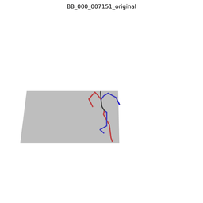
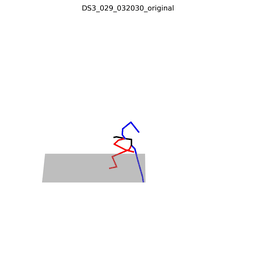

# animationGPT

Character animation generation based on text-to-motion and large models

## Dataset

数据集制作和其他问题：[dataset.md](./dataset/dataset.md)

| Version      | Size                          | Notes                                                        |
| ------------ | ----------------------------- | ------------------------------------------------------------ |
| soul_v1(old) | 30368(with mirror) 15473 | 1. 删除了镜像npy（mirror）后文件数是15473； 2. 注意：Mean.npy和Std.npy的计算不包括镜像文件。 |
| soul_v2      | 14993                         | 1. shinnobi和grappling缺失词性标注导致模型训练崩溃。         |
| soul_v3      | 11662                         | 1. 部分标注异常，例如“The character performs the '忍义手' pose ”； 2. 多个标注内容重复（GPT标注问题）： 其中5个重复（12）、4个重复（19）、3个重复（153）、2个重复（863）。 |
| soul_v4      |                               | Todo                                                         |

**visualization**

|  |  |  |
| :----------------------------------------------------------: | :----------------------------------------------------------: | :----------------------------------------------------------: |
|  |  |  |
|  |  |  |

## Experiment and Animation

当前页面只展示最新结果，其它结果：[animation.md](./animation/animation.md)

### HSmerge

|                   MDM                   |                             MLD                              |                 mGPT                  |
| :-------------------------------------: | :----------------------------------------------------------: | :-----------------------------------: |
|  |  |  |
|                  同上                   |  |  |
|                  同上                   |  |  |

- MDM训练崩溃
- MLD的foot slide问题比较明显

**Render on SMPL(mGPT)**

|    |    |  |
| :---------------------------------------------: | :---------------------------------------------: | :---------------------------------------------: |
|  |  |  |

**evaluation**

| **Metric**                                     |      **MDM**      |      **MLD**      |     **mGPT**      |
| :--------------------------------------------- | :---------------: | :---------------: | :---------------: |
| Matching  Score↓                               | **3.5627±0.0058** |   4.4489±0.0114   |   6.1315±0.0182   |
| Matching  Score (vald)↓ (gt for MLD/mGPT) |   9.6946±0.0370   |   3.5756±0.0058   | **3.5719±0.0056** |
| R_precision  (top 1)↑                          | **0.4499±0.0022** |   0.3276±0.0029   |   0.1825±0.0028   |
| R_precision  (top 2)↑                          | **0.5892±0.0020** |   0.4664±0.0028   |   0.2781±0.0034   |
| R_precision  (top 3)↑                          | **0.6614±0.0018** |   0.5521±0.0024   |   0.3452±0.0033   |
| R_precision (gt top 1)↑                        |   0.0343±0.0021   | **0.4478±0.0027** |   0.4466±0.0031   |
| R_precision  (gt top 2)↑                       |   0.0679±0.0021   |   0.5869±0.0016   | **0.5879±0.0024** |
| R_precision (gt top 3)↑                        |   0.0991±0.0028   | **0.6616±0.0018** |   0.6612±0.0020   |
| FID↓                                           |  63.0029±0.0369   |   1.5230±0.0333   | **0.9084±0.0255** |
| Diversity→                                     |   8.5696±0.0770   | **8.4380±0.1039** |   8.3893±0.0752   |
| Diversity  (vald)→  (gt for MLD/mGPT)     |   0.6601±0.0156   | **8.5630±0.0656** |   8.5648±0.0603   |
| MultiModality ↑                                |       None        | **2.5846±0.0875** |   5.8888±0.1620   |

和soul_v3的评估结果相比，混合训练在各指标上都有明显的提升，这得益于数据集的扩充。
