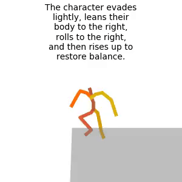

# animationGPT

Character animation generation based on text-to-motion and large models

## Dataset

| Version      | Size                          | Notes                                                        |
| ------------ | ----------------------------- | ------------------------------------------------------------ |
| soul_v1(old) | 30368(with mirror) 15473 | 1. 删除了镜像npy（mirror）后文件数是15473； 2. 注意：Mean.npy和Std.npy的计算不包括镜像文件 |
| soul_v2      | 14993                         | 1. shinnobi和grappling缺失词性标注导致模型训练崩溃。         |
| soul_v3      | 11662                         | 1. 部分标注异常，例如“The character performs the '忍义手' pose ”； 2. 多个标注内容相同（GPT标注问题）。 |
| soul_v4      |                               | Todo                                                         |

[dataset.md](.\dataset\dataset.md)

## Experiment and Animation

[animation.md](.\animation\animation.md)

### soul_v3

#### animations

|                         MDM                         |                             MLD                              |                 mGPT                  |
| :-------------------------------------------------: | :----------------------------------------------------------: | :-----------------------------------: |
|  |  |    |
|              |  |  |
|              |  |  |

#### evaluate

| **Metric**                                     | **MDM**           | **MLD**           | **mGPT**          |
| ---------------------------------------------- | ----------------- | ----------------- | ----------------- |
| Matching  Score↓                               | **5.5293±0.0030** | 5.8812±0.0098     | 6.1470±0.0140     |
| Matching  Score (vald)↓ (gt for MLD/mGPT) | 5.9708±0.0180     | 5.5263±0.0038     | 5.5185±0.0043     |
| R_precision  (top 1)↑                          | **0.0925±0.0024** | 0.0799±0.0025     | 0.0668±0.0018     |
| R_precision  (top 2)↑                          | **0.1595±0.0022** | 0.1397±0.0027     | 0.1250±0.0031     |
| R_precision  (top 3)↑                          | **0.2136±0.0025** | 0.1937±0.0026     | 0.1730±0.0031     |
| R_precision (gt top 1)↑                        | -                 | 0.0935±0.0017     | 0.0929±0.0019     |
| R_precision  (gt top 2)↑                       | -                 | 0.1549±0.0029     | 0.1586±0.0023     |
| R_precision (gt top 3)↑                        | -                 | 0.2128±0.0035     | 0.2130±0.0029     |
| FID↓                                           | **0.8895±0.0369** | 1.0979±0.0337     | 1.3792±0.0498     |
| Diversity→                                     | 5.6927±0.0331     | **5.7232±0.0613** | 5.7904±0.0510     |
| Diversity  (vald)→  (gt for MLD/mGPT)     | 5.8120±0.0555     | 5.8062±0.0386     | 5.6903±0.0740     |
| MultiModality ↑                                | None              | 1.9912±0.0469     | **3.6207±0.0872** |

综合上述指标，MDM在条件匹配程度上表现较好，MLD在生成质量上表现较好，mGPT在生成多样性上表现较好。

