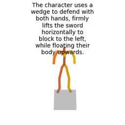
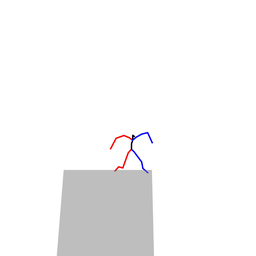

# animationGPT

Character animation generation based on text-to-motion and large models

## Dataset

| Version      | Size                          | Notes                                                        |
| ------------ | ----------------------------- | ------------------------------------------------------------ |
| soul_v1(old) | 30368(with mirror) 15473 | 1. 删除了镜像npy（mirror）后文件数是15473； 2. 注意：Mean.npy和Std.npy的计算不包括镜像文件 |
| soul_v2      | 14993                         | 1. shinnobi和grappling缺失词性标注导致模型训练崩溃。         |
| soul_v3      | 11662                         | 1. 部分标注异常，例如“The character performs the '忍义手' pose ”； 2. 多个标注内容相同（GPT标注问题）。 |
| soul_v4      |                               | Todo                                                         |

[dataset.md](./dataset/dataset.md)

## Experiment and Animation

当前页面只展示最新结果，其它结果：[animation.md](./animation/animation.md)

### HSmerge

|                   MDM                   |                             MLD                              |                 mGPT                  |
| :-------------------------------------: | :----------------------------------------------------------: | :-----------------------------------: |
|  |  |  |
|                  同上                   |  |  |
|                  同上                   |  |  |

- MDM训练崩溃
- MLD的foot slide问题比较明显
