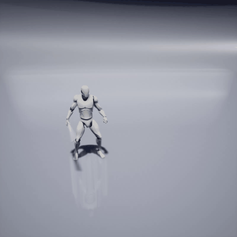
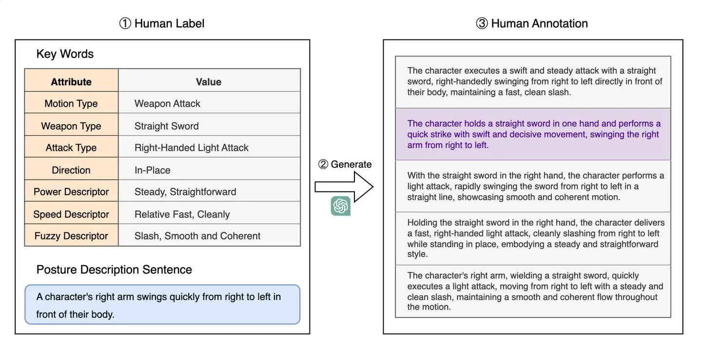

# AnimationGPT

<p align="center">
    <!-- Project Page Link -->
    <a href="http://www.animationgpt.net" style="text-decoration: none;">
        
    </a>
    <!-- Zhihu Link -->
    <a href="https://zhuanlan.zhihu.com/p/691984079" style="text-decoration: none;">
        
    </a>
    <!-- Bilibili Code Link -->
    <a href="https://www.bilibili.com/video/BV1yt421j7nR" style="text-decoration: none;">
        
    </a>
</p>


AnimationGPT is a project focused on generating combat style character animations based on text. This project is trained on the [MotionGPT](https://github.com/OpenMotionLab/MotionGPT) and has produced the first character animation dataset dedicated to combat styles, named CombatMotion, which comes with textual descriptions.

<video width="100%" height="auto" controls>
  <source src="README.assets/videoDemo.mp4" type="video/mp4">
</video>


**Compare to current text-to-motion dataset**

| Dataset                                                      | Motions    | Texts      | Style      | Source               |
| ------------------------------------------------------------ | ---------- | ---------- | ---------- | -------------------- |
| [KIT-ML](https://motion-annotation.humanoids.kit.edu/dataset/) | 3,911      | 6,278      | Daily Life | Motion Capture       |
| [HumanML3D](https://github.com/EricGuo5513/HumanML3D)        | 14,616     | 44,970     | Daily Life | Motion Capture       |
| [Motion-X](https://github.com/IDEA-Research/Motion-X)        | 81,084     | 81,084     | Daily Life | Video Reconstruction |
| **CMP**                                                      | **8,700**  | **26,100** | **Combat** | **Game**             |
| **CMR**                                                      | **14,883** | **14,883** | **Combat** | **Game**             |

Compared to the current text-to-motion datasets, CombatMotion has the following characteristics:

1. Derived from game assets.
2. Features a fighting style, where the animation style in action games tends to be concentrated, and the types of actions are biased.
3. More detailed textual annotations.


## Combat Motion Dataset

###  Pipline

1. Obtain game assets in FBX format, redirect them to SMPL, and read the coordinates of human body joints (refer to [Fbx2SMPL](https://github.com/syan2018/Fbx2SMPL));

2. Add textual annotations. For each animation, manually annotate it from the following aspects: action type, weapon type, attack type, locational words, power descriptor words, speed descriptor words, and confusion descriptor words. A partial list of terms is shown below:

   | **Action  type** | **Weapon  type** | **Attack  type** | **Locative  words** | **Power**      | **Speed**     | **Fuzzy** |
   | ---------------- | ---------------- | ---------------- | ------------------- | -------------- | ------------- | --------- |
   | Idle             | Bare Hand        | Left-Handed      | In-Place            | Light-Weighted | Swift         | Piercing  |
   | Get Hit          | Sacred Seal      | Right-Handed     | Towards Left        | Steady         | Relative Fast | Slash     |
   | Death            | Fist             | One-Handed       | Towards Right       | Heavy-Weighted | Uniform Speed | Blunt     |
   | …                | …                | …                | …                   | …              | …             | …         |

   Then, use GPT-4 to combine these annotations into sentences.

   |  |  |
   | ------------------------------------- | ------------------------------------------- |

   The diagram above outlines our annotation process. Initially, we fill in seven key descriptive words based on the characteristics of the animation, followed by writing posture description sentences. Subsequently, we use a large language model to integrate these elements into several complete natural language sentences. Finally, we select the sentence that best meets our requirements as the annotation result.

3. Process the animation and annotated data into a format compatible with [HumanML3D](https://github.com/EricGuo5513/HumanML3D).


### CombatMotionProcessed Dataset(CMP)

Download: [google drive](https://drive.google.com/file/d/17tldNzQ2aFqwxwoqBAs4YqyDUnnPy8We/view?usp=drive_link)

CombatMotionProcessed(CMP) is a refined dataset that, in terms of character animation, retains 8,700 high-quality animations with a strong fighting style. In terms of textual annotations, we provide three text annotations for each animation: a concise description, a concise description with sensory details, and a detailed description.

Taking `CMP008388` as an example, its corresponding text annotations are:

```
weapon attack a man holding a Katana,executing a Charged Heavy Attack,Dual Wielding,root motion get Forward, Steady,Powerful and Relative Slow,First slow then fast,Cleanly.
weapon attack a man holding a Katana,executing a Charged Heavy Attack,Dual Wielding,root motion get Forward, Steady,Powerful and Relative Slow,First slow then fast,Cleanly,which make a sense of Piercing,Wide Open,Charged,Accumulating strength.
The character grips the wedge with both hands and charges for a powerful strike. They firmly lower their body, twist to the left, lunge forward with a bow step, and stab with the sword held in both hands.
```


### CombatMotionRaw Dataset(CMR)

Download: [google drive](https://drive.google.com/file/d/148AwoovJrnh4F0q_HbU83WCWwFooLSZj/view?usp=drive_link)

CombatMotionRaw (CMR) is an unrefined dataset containing 14,883 animation entries (CMP is a subset of CMR), but each animation is only provided with one textual annotation. Moreover, the textual annotations in CMR consist of simple concatenations of annotated words. It was found during project development that models trained with this type of annotation performed poorly, thus this format was ultimately not adopted.

Example of textual annotation:

```
weapon attack curved sword curved greatsword right-handed one-handed charged heavy attack forward steady powerful charged accumulating strength cleanly first slow then fast slash smooth and coherent wide open featherlike roundabout lean over and twist your waist to the left step forward with your right leg store your right hand from the left back swing it diagonally downward and swing two circles.
```

CMR has a richer set of animation data, unfortunately, the annotations are not detailed enough. You can read the textual annotations from the dataset yourself and refine them.

## Model and Evaluation

Here are models trained on the CMP dataset using different algorithms:

- MotionGPT Model：[google drive](https://drive.google.com/file/d/1myqSqe41JpJCd0JaIu0FVPf93FI0A22L/view?usp=drive_link)
- MLD Model：[google drive](https://drive.google.com/file/d/161gtb0vZlitE6N4B2RrKETomnTPgOQmi/view?usp=drive_link)
- MDM Model：[google drive](https://drive.google.com/file/d/1Uzb2aFsQXq4Df3SBEc7cwXv8OobwDtto/view?usp=drive_link)

**Evaluation on CMP**

| Metric                              | MotionGPT      | MLD            | MDM             |
| ----------------------------------- | -------------- | -------------- | --------------- |
| Matching  Score↓                    | 5.426  ± 0.017 | 5.753  ± 0.019 | 7.220  ± 0.018  |
| Matching  Score (Ground Truth)↓     | 5.166  ± 0.012 | 5.177  ± 0.018 | 5.179  ± 0.013  |
| R_precision  (top 1)↑               | 0.044  ± 0.002 | 0.048  ± 0.002 | 0.030  ± 0.001  |
| R_precision  (top 2)↑               | 0.084  ± 0.003 | 0.089  ± 0.003 | 0.063  ± 0.002  |
| R_precision  (top 3)↑               | 0.122  ± 0.003 | 0.126  ± 0.003 | 0.096  ± 0.002  |
| R_precision  (top 1)(Ground Truth)↑ | 0.050  ± 0.002 | 0.051  ± 0.002 | 0.053  ± 0.002  |
| R_precision  (top 2)(Ground Truth)↑ | 0.094  ± 0.002 | 0.095  ± 0.003 | 0.097  ± 0.003  |
| R_precision  (top 3)(Ground Truth)↑ | 0.133  ± 0.003 | 0.134  ± 0.004 | 0.136  ± 0.004  |
| FID↓                                | 0.531  ± 0.018 | 1.240  ± 0.036 | 40.395  ± 0.424 |
| Diversity→                          | 5.143  ± 0.052 | 5.269  ± 0.044 | 3.364  ± 0.080  |
| Diversity  (Ground Truth)→          | 5.188  ± 0.070 | 5.200  ± 0.049 | 5.191  ± 0.036  |
| MultiModality  ↑                    | 1.793 ± 0.094  | 2.618 ± 0.115  | 2.463 ± 0.102   |


## Tutorial

- If you need to train a model, please download the [CMP dataset](https://drive.google.com/file/d/17tldNzQ2aFqwxwoqBAs4YqyDUnnPy8We/view?usp=drive_link). Then, follow the tutorials for [MotionGPT](https://github.com/OpenMotionLab/MotionGPT) or other text-to-motion algorithms to set up the environment and train your model.

- If you only need to use the AGPT model trained on the CMP dataset, please follow these steps:

  1. Set up the environment

     Our experimental environment is Ubuntu 22.04, NVIDIA GeForce RTX 4090, and CUDA 11.8
  
     ```
     git clone https://github.com/OpenMotionLab/MotionGPT.git
     cd MotionGPT
     conda create python=3.10 --name mgpt
     conda activate mgpt
     pip install -r requirements.txt
     python -m spacy download en_core_web_sm
     mkdir deps
     cd deps
     bash prepare/prepare_t5.sh
     bash prepare/download_t2m_evaluators.sh
     ```

  2. Download the [CMP dataset](https://drive.google.com/file/d/17tldNzQ2aFqwxwoqBAs4YqyDUnnPy8We/view?usp=drive_link)

     Unzip the dataset into the `datasets/humanml3d` directory.
  
     ```
     .
     └── humanml3d
         ├── new_joint_vecs
         ├── new_joints
         └── texts
     ```

  3. Generate animations using the model

     - `git clone https://github.com/fyyakaxyy/AnimationGPT.git`
  
     - Copy the `tools` folder and `config_AGPT.yaml` into the `MotionGPT` directory
  
     - Download the [AGPT model](https://drive.google.com/file/d/1myqSqe41JpJCd0JaIu0FVPf93FI0A22L/view?usp=drive_link), place it in the `MotionGPT` directory
     - Save the prompt in `input.txt`
     - Run `python demo.py --cfg ./config_AGPT.yaml --example ./input.txt`

     The generated result is `id_out.npy`, stored in `results/mgpt/debug--AGPT/`
  
  4. File format conversion
  
     - Convert the generated npy files to mp4 files: modify the file path in `tools/animation.py`, then run: `python animation.py`
     - Convert the generated npy files to bvh files: modify the file path in `tools/npy2bvh/joints2bvh.py`, then run: `python joints2bvh.py`
       Note: The code for npy2bvh is sourced from [Momask](https://github.com/EricGuo5513/momask-codes/blob/main/visualization/joints2bvh.py)

### Windows10 Tutorial

Use the AGPT model trained on the CMP dataset under Windows10:

- When configuring the environment for [MotionGPT](https://github.com/OpenMotionLab/MotionGPT/tree/0499f16df4ddde44dfd72a7cbd7bd615af1b1a94) (step 1), some packages may still be missing after using python=3.10.6 and installing requirements.txt, just follow the instructions to install them manually.

- Windows file path separator and linux are different, some path errors need to be changed to the Win system separator, such as the separator `'/'` change to `os.sep` in the [config.py](https://github.com/OpenMotionLab/MotionGPT/blob/0499f16df4ddde44dfd72a7cbd7bd615af1b1a94/mGPT/config.py#L17)
  
- Convert the generated npy files to mp4 files under python=3.10 environment may report errors. The matplotlib library requires version 3.3.3, but the minimum supported library version of cp310 is 3.5.0. If you use a library version higher than 3.5.0, you will encounter the following error:

    `ax.lines = [] AttributeError: can't set attribute`，

    `ax.collections = [] AttributeError: can't set attribute`，

    `ani.save "ValueError: unknown file extension: .mp4`.

If you encounter only the first two errors when executing with matplotlib>=3.5.0, you can refer to this issue https://github.com/GuyTevet/motion-diffusion-model/issues/6.

If you are also experiencing unrecognized mp4 files, you need to additionally download [ffmpeg](https://github.com/GyanD/codexffmpeg/releases/tag/2024-05-06-git-96449cfeae), unzip it and modify these contents in `tools/animation.py`:
```python
import matplotlib.pyplot as plt
plt.rcParams['animation.ffmpeg_path'] = r'D:\\ffmpeg\\bin\\ffmpeg.exe' #ffmpeg floder
from mpl_toolkits.mplot3d import Axes3D
```

If you have successfully generated a video file after resolving the error, but the video only has a white screen, please try switching to another python version to do the npy file format conversion. `tools/requirements.txt` provides the necessary dependencies for python=3.9.19 to work properly.

- The following problems may be encountered when converting the generated npy files to bvh files

  1. Some packages are missing or numpy is reporting errors. Prioritize using python=3.9.19 and install the dependencies in `tools/requirements.txt.`

  2. `tools/npy2bvh/joints2bvh.py` is missing some package imports. Add this code:
     
     ```python
     import matplotlib
     import matplotlib.pyplot as plt
     from mpl_toolkits.mplot3d.art3d import Poly3DCollection
     import mpl_toolkits.mplot3d.axes3d as p3
     ```
     
  3. `No such file or directory: './visualization/data/template.bvh'`. Modify the following path to use the commented out version:
     
     ```python
     self.template = BVH.load('./visualization/data/template.bvh', need_quater=True)
     #self.template = BVH.load(os.path.dirname(__file__) + '\\visualization\\data\\template.bvh', need_quater=True)
     ```
     
  4. `index 1 is out of bounds for axis 1 with size 1`. Make sure there is no `_in.npy` file in the path of the file you want to convert, just keep `_out.npy` to solve the problem.


## Suggestions

During the process of dataset creation and model training/tuning, you might encounter some issues in aspects like textual annotations, model training, and data augmentation. Based on our experience, we offer the following suggestions:

### Model Training Crashes Due to Errors in Textual Annotations

If you process data using the HumanML3D pipeline, you might encounter the following issues, which can lead to model training crashes:

- The textual description contains Chinese characters or Chinese punctuation.
- Some words fail to be successfully annotated with part-of-speech tags.
- Certain mathematical symbols, such as the degree symbol "°", are recognized as abnormal characters.

### Exploration of Textual Annotations

- Adding descriptions of root motion direction in the annotated text can help the model learn directional words.
- Adding frame number information to the annotated text does not enable the model to learn how to control the duration (or number of frames) of generation.
- The more detailed the textual annotations and the greater the number of different annotations for the same animation, the better the performance of the model.

### Mixed Training

Mixing the HumanML3D, KIT-ML, and CMP datasets for model training can result in significant improvements in evaluation metrics. 

However, evaluation metrics and visual effects are not equivalent. For some generated results, models trained on a mixed dataset perform worse than those trained solely on the CMP dataset. Because differences in action styles between datasets change the data distribution, thereby affecting model performance.

### Motion-X-to-HumanML3D

You can try converting [Motion-X](https://github.com/IDEA-Research/Motion-X) into the HumanML3D format for pre-training the model, and then fine-tuning it on the CMP dataset.

[Motion-X-to-HumanML3D](https://github.com/IDEA-Research/Motion-X/tree/main/tomato_represenation/motionx2humanml)


## Acknowledgments

- Algorithm: Thanks to [MotionGPT](https://github.com/OpenMotionLab/MotionGPT), [MLD](https://github.com/ChenFengYe/motion-latent-diffusion), [MDM](https://github.com/GuyTevet/motion-diffusion-model) and [Momask](https://github.com/EricGuo5513/momask-codes).
- Dataset: Thanks to [HumanML3D](https://github.com/EricGuo5513/HumanML3D) and [Motion-X](https://github.com/IDEA-Research/Motion-X).

Our code is partially borrowing from them.

## Citation

If you find this repository useful, please consider citing it as follows:

```
@misc{CombatMotion,
  title={AnimationGPT:An AIGC tool for generating game combat motion assets},
  author={Yihao Liao, Yiyu Fu, Ziming Cheng, Jiangfeiyang Wang},
  year={2024},
  howpublished={\url{https://github.com/fyyakaxyy/AnimationGPT}}
}
```

```
@InProceedings{Guo_2022_CVPR,
    author    = {Guo, Chuan and Zou, Shihao and Zuo, Xinxin and Wang, Sen and Ji, Wei and Li, Xingyu and Cheng, Li},
    title     = {Generating Diverse and Natural 3D Human Motions From Text},
    booktitle = {Proceedings of the IEEE/CVF Conference on Computer Vision and Pattern Recognition (CVPR)},
    month     = {June},
    year      = {2022},
    pages     = {5152-5161}
}
```

```
@article{jiang2024motiongpt,
  title={Motiongpt: Human motion as a foreign language},
  author={Jiang, Biao and Chen, Xin and Liu, Wen and Yu, Jingyi and Yu, Gang and Chen, Tao},
  journal={Advances in Neural Information Processing Systems},
  volume={36},
  year={2024}
}
```


# AnimationGPT（中文）

<p align="center">
    <!-- Project Page Link -->
    <a href="http://www.animationgpt.net" style="text-decoration: none;">
        
    </a>
    <!-- Zhihu Link -->
    <a href="https://zhuanlan.zhihu.com/p/691984079" style="text-decoration: none;">
        
    </a>
    <!-- Bilibili Code Link -->
    <a href="https://www.bilibili.com/video/BV1yt421j7nR" style="text-decoration: none;">
        
    </a>
</p>


AnimationGPT是一个基于文本生成格斗风格角色动画的项目。本项目基于[MotionGPT](https://github.com/OpenMotionLab/MotionGPT)训练模型，并且制作了首个专注于格斗风格、并配备文本描述的角色动画数据集CombatMotion。

<video width="100%" height="auto" controls>
  <source src="README.assets/videoDemo.mp4" type="video/mp4">
</video>


**对比现有文本-动作数据集**

| 数据集                                                       | 动作数量   | 文本数量   | 风格 | 来源     |
| ------------------------------------------------------------ | ---------- | ---------- | ---- | -------- |
| [KIT-ML](https://motion-annotation.humanoids.kit.edu/dataset/) | 3,911      | 6,278      | 日常 | 动作捕捉 |
| [HumanML3D](https://github.com/EricGuo5513/HumanML3D)        | 14,616     | 44,970     | 日常 | 动作捕捉 |
| [Motion-X](https://github.com/IDEA-Research/Motion-X)        | 81,084     | 81,084     | 日常 | 视频重建 |
| **CMP**                                                      | **8,700**  | **26,100** | 格斗 | 游戏     |
| **CMR**                                                      | **14,883** | **14,883** | 格斗 | 游戏     |

与现有文本-动作数据集相比，CombatMotion具有如下特点：

1. 来源于游戏资产。
2. 具有格斗风格，动作类游戏当中的动画风格相对来说是集中的，动作类型有偏。
3. 具有更详细的文本标注。


## Combat Motion数据集

###  处理流程

1. 获取fbx格式的游戏资产，重定向到SMPL，并读取人体关节点坐标（[参考Fbx2SMPL](https://github.com/syan2018/Fbx2SMPL)）；

2. 添加文本标注。对于每一条动画，首先从动作类型、武器类型、攻击类型、方位词、力量感描述词、速度描述词和困惑描述词这几个方面添加人工标注，部分词表如下所示：

   | **Action  type** | **Weapon  type** | **Attack  type** | **Locative  words** | **Power**      | **Speed**     | **Fuzzy** |
   | ---------------- | ---------------- | ---------------- | ------------------- | -------------- | ------------- | --------- |
   | Idle             | Bare Hand        | Left-Handed      | In-Place            | Light-Weighted | Swift         | Piercing  |
   | Get Hit          | Sacred Seal      | Right-Handed     | Towards Left        | Steady         | Relative Fast | Slash     |
   | Death            | Fist             | One-Handed       | Towards Right       | Heavy-Weighted | Uniform Speed | Blunt     |
   | …                | …                | …                | …                   | …              | …             | …         |

   然后通过GPT-4将这些标注连接成句子。

   |  |  |
   | ------------------------------------- | ------------------------------------------- |

   上图概述了我们制作标注的过程，首先基于动作动画的特性填写七大类关键描述词，再撰写姿势描述句，随后利用大语言模型将这些要素融合成为数个完整的自然语言句子，最后从中挑选最符合需求的作为标注结果。

3. 将动画和标注数据处理成[HumanML3D](https://github.com/EricGuo5513/HumanML3D)格式的数据。


### CombatMotionProcessed数据集(CMP)

下载链接：[google drive](https://drive.google.com/file/d/17tldNzQ2aFqwxwoqBAs4YqyDUnnPy8We/view?usp=drive_link)

CombatMotionProcessed(CMP)是精加工的数据集，在角色动画方面，我们保留了高质量、格斗风格强的8,700个动画，在文本标注方面，我们为每一条动画提供了3条文本标注，分别是精简版描述、带有感觉描述的精简版描述和详细版描述。

以`CMP008388`为例，其对应的文本标注是：

```
weapon attack a man holding a Katana,executing a Charged Heavy Attack,Dual Wielding,root motion get Forward, Steady,Powerful and Relative Slow,First slow then fast,Cleanly.
weapon attack a man holding a Katana,executing a Charged Heavy Attack,Dual Wielding,root motion get Forward, Steady,Powerful and Relative Slow,First slow then fast,Cleanly,which make a sense of Piercing,Wide Open,Charged,Accumulating strength.
The character grips the wedge with both hands and charges for a powerful strike. They firmly lower their body, twist to the left, lunge forward with a bow step, and stab with the sword held in both hands.
```


### CombatMotionRaw数据集(CMR)

下载链接：[google drive](https://drive.google.com/file/d/148AwoovJrnh4F0q_HbU83WCWwFooLSZj/view?usp=drive_link)

CombatMotionRaw(CMR)是未经过精加工的数据集，具备14,883个的动画数据（CMP是CMR的子集），但每条动画只提供一个文本标注。另外，CMR中的文本标注是标注词的简单连接，在项目研发中发现这种标注训练的模型性能较差，因此最终未采用这种格式。

文本标注示例：

```
weapon attack curved sword curved greatsword right-handed one-handed charged heavy attack forward steady powerful charged accumulating strength cleanly first slow then fast slash smooth and coherent wide open featherlike roundabout lean over and twist your waist to the left step forward with your right leg store your right hand from the left back swing it diagonally downward and swing two circles.
```

CMR具备更丰富的动画数据，可惜标注不够精细，您可以自行读取数据集中的文本标注并优化。


## 模型和评估

以下分别是在CMP数据集上用不同算法训练的模型：

- MotionGPT Model：[google drive](https://drive.google.com/file/d/1myqSqe41JpJCd0JaIu0FVPf93FI0A22L/view?usp=drive_link)
- MLD Model：[google drive](https://drive.google.com/file/d/161gtb0vZlitE6N4B2RrKETomnTPgOQmi/view?usp=drive_link)
- MDM Model：[google drive](https://drive.google.com/file/d/1Uzb2aFsQXq4Df3SBEc7cwXv8OobwDtto/view?usp=drive_link)

**CMP数据集上的评估结果**

| Metric                              | MotionGPT      | MLD            | MDM             |
| ----------------------------------- | -------------- | -------------- | --------------- |
| Matching  Score↓                    | 5.426  ± 0.017 | 5.753  ± 0.019 | 7.220  ± 0.018  |
| Matching  Score (Ground Truth)↓     | 5.166  ± 0.012 | 5.177  ± 0.018 | 5.179  ± 0.013  |
| R_precision  (top 1)↑               | 0.044  ± 0.002 | 0.048  ± 0.002 | 0.030  ± 0.001  |
| R_precision  (top 2)↑               | 0.084  ± 0.003 | 0.089  ± 0.003 | 0.063  ± 0.002  |
| R_precision  (top 3)↑               | 0.122  ± 0.003 | 0.126  ± 0.003 | 0.096  ± 0.002  |
| R_precision  (top 1)(Ground Truth)↑ | 0.050  ± 0.002 | 0.051  ± 0.002 | 0.053  ± 0.002  |
| R_precision  (top 2)(Ground Truth)↑ | 0.094  ± 0.002 | 0.095  ± 0.003 | 0.097  ± 0.003  |
| R_precision  (top 3)(Ground Truth)↑ | 0.133  ± 0.003 | 0.134  ± 0.004 | 0.136  ± 0.004  |
| FID↓                                | 0.531  ± 0.018 | 1.240  ± 0.036 | 40.395  ± 0.424 |
| Diversity→                          | 5.143  ± 0.052 | 5.269  ± 0.044 | 3.364  ± 0.080  |
| Diversity  (Ground Truth)→          | 5.188  ± 0.070 | 5.200  ± 0.049 | 5.191  ± 0.036  |
| MultiModality  ↑                    | 1.793 ± 0.094  | 2.618 ± 0.115  | 2.463 ± 0.102   |


## 使用教程

- 如果需要训练模型，请下载[CMP数据集](https://drive.google.com/file/d/17tldNzQ2aFqwxwoqBAs4YqyDUnnPy8We/view?usp=drive_link)，然后按照[MotionGPT](https://github.com/OpenMotionLab/MotionGPT)或其它text-to-motion算法的教程配置环境，训练模型。

- 如果只需要使用CMP数据集上训练好的AGPT模型，请参考以下步骤：

  1. 配置环境

     我们的实验环境是Ubuntu22.04，NVIDIA GeForce RTX 4090，CUDA 11.8
  
     ```
     git clone https://github.com/OpenMotionLab/MotionGPT.git
     cd MotionGPT
     conda create python=3.10 --name mgpt
     conda activate mgpt
     pip install -r requirements.txt
     python -m spacy download en_core_web_sm
     mkdir deps
     cd deps
     bash prepare/prepare_t5.sh
     bash prepare/download_t2m_evaluators.sh
     ```

  2. 下载CMP数据集

     将数据集解压到`datasets/humanml3d`路径下。
  
     ```
     .
     └── humanml3d
         ├── new_joint_vecs
         ├── new_joints
         └── texts
     ```

  3. 使用模型生成动画

     - `git clone https://github.com/fyyakaxyy/AnimationGPT.git`
  
     - 将`tools`文件夹和`config_AGPT.yaml`复制到`MotionGPT`文件夹下
  
     - 下载[AGPT model](https://drive.google.com/file/d/1myqSqe41JpJCd0JaIu0FVPf93FI0A22L/view?usp=drive_link)，放置在`MotionGPT`路径下
     - 将prompt保存到`input.txt`中
     - `python demo.py --cfg ./config_AGPT.yaml --example ./input.txt`

     生成的结果是`id_out.npy`，保存在`results/mgpt/debug--AGPT/`路径下
  
  4. 文件格式转换
  
     - 将生成的npy文件转为mp4文件：修改`tools/animation.py`中的文件路径，然后运行：`python animation.py`
     - 将生成的npy文件转为bvh文件：修改`tools/npy2bvh/joints2bvh.py`中的文件路径，然后运行：`python joints2bvh.py`
       备注：npy2bvh的代码来源于[Momask](https://github.com/EricGuo5513/momask-codes/blob/main/visualization/joints2bvh.py)

### Windows10使用教程

在Windows10环境下使用训练好的模型：

- 为[MotionGPT](https://github.com/OpenMotionLab/MotionGPT/tree/0499f16df4ddde44dfd72a7cbd7bd615af1b1a94)配置环境时（步骤1），使用其推荐的python=3.10.6并安装完requirements所需包可能仍然缺少一些包，按提示手动安装即可。
  linux系统和windows文件路径分隔符不同，有路径类错误需要改为win系统的分隔符，如[config.py](https://github.com/OpenMotionLab/MotionGPT/blob/0499f16df4ddde44dfd72a7cbd7bd615af1b1a94/mGPT/config.py#L17)中的分隔符`'/'`修改为`os.sep`。
  
- npy文件转为mp4文件时，经测试不适合在python=3.10环境下执行，其matplotlib库需要使用3.3.3旧版本，但cp310最低支持的库版本为3.5.0，如果使用高于3.5.0版本的库会遇到三处报错：

    `ax.lines = [] AttributeError: can't set attribute`，

    `ax.collections = [] AttributeError: can't set attribute`，

    `ani.save "ValueError: unknown file extension: .mp4`

如果您使用matplotlib>=3.5.0执行时只遇到了前两条报错，可以参考https://github.com/GuyTevet/motion-diffusion-model/issues/6。

如果您也遇到了无法识别mp4文件，需要额外下载[ffmpeg](https://github.com/GyanD/codexffmpeg/releases/tag/2024-05-06-git-96449cfeae)，解压并修改`tools/animation.py`中的：
```python
import matplotlib.pyplot as plt
plt.rcParams['animation.ffmpeg_path'] = r'D:\\ffmpeg\\bin\\ffmpeg.exe' #ffmpeg floder
from mpl_toolkits.mplot3d import Axes3D
```

如果您解决报错后生成了视频文件，但视频为纯白画面，请尝试换用其他的python版本来做npy文件格式转换`tools/requirements.txt`提供了python=3.9.19环境下可以正常执行所需的依赖。

- npy文件转为bvh文件时，可能会遇到以下问题：

  1. 缺少某些包或是numpy报错。优先使用python=3.9.19并安装`tools/requirements.txt`中的依赖。

  2. `tools/npy2bvh/joints2bvh.py`缺少import。为其中添加这些代码。
     ```python
     import matplotlib
     import matplotlib.pyplot as plt
     from mpl_toolkits.mplot3d.art3d import Poly3DCollection
     import mpl_toolkits.mplot3d.axes3d as p3
     ```

  3. `No such file or directory: './visualization/data/template.bvh'`。修改下面的路径，换用注释掉的版本。
     
     ```python
     self.template = BVH.load('./visualization/data/template.bvh', need_quater=True)
     #self.template = BVH.load(os.path.dirname(__file__) + '\\visualization\\data\\template.bvh', need_quater=True)
     ```
     
  4. `index 1 is out of bounds for axis 1 with size 1`。不要转换那些`_in.npy`文件，换一个仅包含`_out.npy`文件的路径转换数据。


## 建议

在数据集制作和模型训练调优的过程中，您可能会在文本标注、模型训练、数据增强等方面遇到一些问题。基于我们的经验，给出以下建议：

### 文本标注错误导致模型训练崩溃

如果采用HumanML3D的pipline处理数据，可能会遇到以下问题，它们将会导致模型训练崩溃：

- 文本描述中包含中文字符或中文标点。
- 部分词语无法成功添加词性标注。
- 部分数学符号，例如角度"°"被识别为异常字符。

### 文本标注的探索

- 在标注文本中添加对root motion的方位词描述，可以让模型学习到方位词。
- 在标注文本中添加帧数信息，并不能让模型学会控制生成时长（或帧数）。
- 文本标注越详细、同一条动画的不同标注数量越多，模型的性能越好。

### 混合训练

将HumanML3D、KIT-ML和CMP数据集混合起来训练模型，在评估指标上会带来巨大提升，但评估指标和视觉效果并不等价，对于部分生成结果，混合训练的模型表现不如单独使用CMP数据集训练的模型，这是因为不同数据集动作风格的差异改变了数据分布，进而影响了模型的性能。

### Motion-X到HumanML3D的格式转换

可以尝试将[Motion-X](https://github.com/IDEA-Research/Motion-X)转换成HumanML3D的格式，用于预训练模型，然后在CMP数据集上微调。

[Motion-X-to-HumanML3D](https://github.com/IDEA-Research/Motion-X/tree/main/tomato_represenation/motionx2humanml)


## 致谢

- 算法：感谢 [MotionGPT](https://github.com/OpenMotionLab/MotionGPT) 、[MLD](https://github.com/ChenFengYe/motion-latent-diffusion)、 [MDM](https://github.com/GuyTevet/motion-diffusion-model)以及[Momask](https://github.com/EricGuo5513/momask-codes)。
- 数据集：感谢 [HumanML3D](https://github.com/EricGuo5513/HumanML3D) 和 [Motion-X](https://github.com/IDEA-Research/Motion-X)。

我们的代码部分借鉴了以上工作。

## 引用

如果您觉得这个仓库对您有用，请考虑引用：

```
@misc{CombatMotion,
  title={AnimationGPT:An AIGC tool for generating game combat motion assets},
  author={Yihao Liao, Yiyu Fu, Ziming Cheng, Jiangfeiyang Wang},
  year={2024},
  howpublished={\url{https://github.com/fyyakaxyy/AnimationGPT}}
}
```

```
@InProceedings{Guo_2022_CVPR,
    author    = {Guo, Chuan and Zou, Shihao and Zuo, Xinxin and Wang, Sen and Ji, Wei and Li, Xingyu and Cheng, Li},
    title     = {Generating Diverse and Natural 3D Human Motions From Text},
    booktitle = {Proceedings of the IEEE/CVF Conference on Computer Vision and Pattern Recognition (CVPR)},
    month     = {June},
    year      = {2022},
    pages     = {5152-5161}
}
```

```
@article{jiang2024motiongpt,
  title={Motiongpt: Human motion as a foreign language},
  author={Jiang, Biao and Chen, Xin and Liu, Wen and Yu, Jingyi and Yu, Gang and Chen, Tao},
  journal={Advances in Neural Information Processing Systems},
  volume={36},
  year={2024}
}
```

