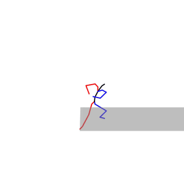
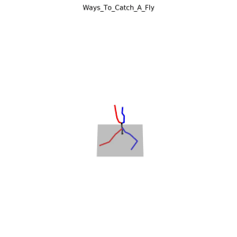
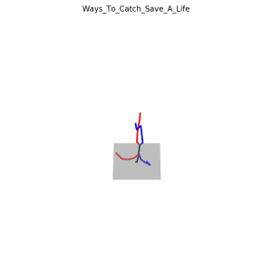
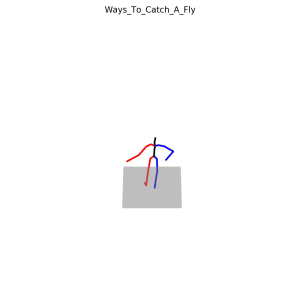
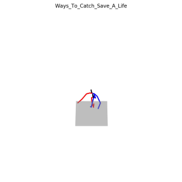
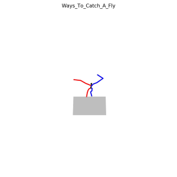
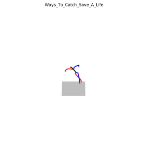

# AnimationGPT

AnimationGPT是一个基于文本生成格斗风格角色动画的项目。本项目基于[MotionGPT](https://github.com/OpenMotionLab/MotionGPT)训练模型，并且制作了首个专注于格斗风格、并配备文本描述的角色动画数据集。

**Compare to current text-to-motion dataset**

| Dataset   | Motions    | Texts      | Style      | Source                             |
| --------- | ---------- | ---------- | ---------- | ---------------------------------- |
| KIT-ML    | 3,911      | 6,278      | Daily      | Motion Capture                     |
| HumanML3D | 14,616     | 44,970     | Daily      | Motion Capture                     |
| Motion-X  | 81,084     | 95,642     | Daily      | Video Reconstruction               |
| **CMP**   | **8700**   | **26,100** | **Combat** | **Digital Entertainment Products** |
| **CMR**   | **14,883** | **14,883** | **Combat** | **Digital Entertainment Products** |

与当前主流的text-to-motion数据集相比，CombatMotion具有如下特点：

1. 来源于游戏资产；
2. 具有格斗风格，动作类游戏当中的动画风格相对来说是集中的，动作类型有偏；
3. 更详细的文本标注。

## Combat Motion Dataset

###  Pipline

1. 获取fbx格式的游戏资产，重定向到SMPL，并读取人体关节点坐标（[参考Fbx2SMPL](https://github.com/syan2018/Fbx2SMPL)）；

2. 添加文本标注。对于每一条动画，首先从动作类型、武器类型、攻击类型、方位词、力量感描述词、速度描述词和困惑描述词这几个方面添加人工标注，部分词表如下所示：

   | **Action  type** | **Weapon  type** | **Attack  type** | **Locative  words** | **Power**      | **Speed**     | **Fuzzy** |
   | ---------------- | ---------------- | ---------------- | ------------------- | -------------- | ------------- | --------- |
   | Idle             | Bare Hand        | Left-Handed      | In-Place            | Light-Weighted | Swift         | Piercing  |
   | Get Hit          | Sacred Seal      | Right-Handed     | Towards Left        | Steady         | Relative Fast | Slash     |
   | Death            | Fist             | One-Handed       | Towards Right       | Heavy-Weighted | Uniform Speed | Blunt     |
   | …                | …                | …                | …                   | …              | …             | …         |

   然后通过GPT-4将这些标注连接成句子。

3. 将动画和标注数据处理成[HumanML3D](https://github.com/EricGuo5513/HumanML3D)格式的数据。


### CombatMotionProcessed Dataset(CMP)

下载链接：[google driver]()

CombatMotionRaw(CMP)是精加工的数据集，在角色动画方面，我们保留了高质量、格斗风格强的8700个动画，在文本标注方面，我们为每一条动画提供了3条文本标注，分别是精简版描述、带有感觉描述的精简版描述和详细版描述。

以`CMP008388`为例：




其对应的文本标注是：

```
weapon attack a man holding a Katana,executing a Charged Heavy Attack,Dual Wielding,root motion get Forward, Steady,Powerful and Relative Slow,First slow then fast,Cleanly.
weapon attack a man holding a Katana,executing a Charged Heavy Attack,Dual Wielding,root motion get Forward, Steady,Powerful and Relative Slow,First slow then fast,Cleanly,which make a sense of Piercing,Wide Open,Charged,Accumulating strength.
The character grips the wedge with both hands and charges for a powerful strike. They firmly lower their body, twist to the left, lunge forward with a bow step, and stab with the sword held in both hands.
```


### CombatMotionRaw Dataset(CMR)

下载链接：[google driver]()

CombatMotionRaw(CMR)是未经过精加工的数据集，具备14,883个的动画数据（CMP是CMR的子集），但每条动画只提供一个文本标注。另外，CMR中的文本标注是标注词的简单连接，在项目研发中发现这种标注训练的模型性能较差，因此最终未采用这种格式。

文本标注示例：

```
weapon attack curved sword curved greatsword right-handed one-handed charged heavy attack forward steady powerful charged accumulating strength cleanly first slow then fast slash smooth and coherent wide open featherlike roundabout lean over and twist your waist to the left step forward with your right leg store your right hand from the left back swing it diagonally downward and swing two circles.
```

CMR具备更丰富的动画数据，可惜标注不够精细，你可以自行读取数据集中的文本标注并优化。

## Model and Evaluation

以下分别是在CMR数据集上用不同算法训练的模型：

- MotionGPT：[google driver]()
- MLD：[google driver]()
- MDM：[google driver]()

**Evaluation on CMP**

| Metric                              | MotionGPT      | MLD            | MDM            |
| ----------------------------------- | -------------- | -------------- | -------------- |
| Matching  Score↓                    | 5.426  ± 0.017 | 5.753  ± 0.019 | 5.179  ± 0.013 |
| Matching  Score (Ground Truth)↓     | 5.166  ± 0.012 | 5.177  ± 0.018 | 7.220  ± 0.018 |
| R_precision  (top 1)↑               | 0.044  ± 0.002 | 0.048  ± 0.002 | 0.053  ± 0.002 |
| R_precision  (top 2)↑               | 0.084  ± 0.003 | 0.089  ± 0.003 | 0.097  ± 0.003 |
| R_precision  (top 3)↑               | 0.122  ± 0.003 | 0.126  ± 0.003 | 0.136  ± 0.004 |
| R_precision  (top 1)(Ground Truth)↑ | 0.050  ± 0.002 | 0.051  ± 0.002 | 0.030  ± 0.001 |
| R_precision  (top 2)(Ground Truth)↑ | 0.094  ± 0.002 | 0.095  ± 0.003 | 0.063  ± 0.002 |
| R_precision  (top 3)(Ground Truth)↑ | 0.133  ± 0.003 | 0.134  ± 0.004 | 0.096  ± 0.002 |
| FID↓                                | 0.531  ± 0.018 | 1.240  ± 0.036 | 0.019  ± 0.001 |
| Diversity→                          | 5.143  ± 0.052 | 5.269  ± 0.044 | 5.191  ± 0.036 |
| Diversity  (Ground Truth)→          | 5.188  ± 0.070 | 5.200  ± 0.049 | 3.364  ± 0.080 |
| MultiModality  ↑                    | 1.793 ± 0.094  | 2.618 ± 0.115  | 2.463 ± 0.102  |

## Some Advice

在数据集制作和模型训练过程中，你可能会在文本标注、模型训练、数据增强等方面遇到一些问题。基于我们的经验，给出以下建议：

### 文本标注错误导致模型训练崩溃

如果你也是采用HumanML3D的pipline处理数据，你可能会遇到以下问题，它们将会导致模型训练崩溃：

- 文本描述中包含中文字符或中文标点，例如"The character performs the '忍义手' pose "；
- 部分词语在词性标注时被遗漏，例如标注程序无法识别并标注"shinnobi"和"grappling";
- 部分数学符号，例如角度"°"被识别为异常字符。

### 文本标注词的探索

- 在标注文本中添加对root motion的方位词描述，可以让模型学习到方位词；
- 在标注文本中添加帧数信息，并不能让模型学会控制生成时长（或帧数）；
- 文本标注越详细、同一条动画的不同标注数量越多，模型的性能越好。

### 混合训练

将HumanML3D和CMP数据集混合起来训练模型，在评估指标上会带来很大的提升，但评估指标和视觉效果并不等价，混合训练的模型生成的部分结果不如单独使用CMP数据集训练的模型生成效果，这是因为两个数据集动作风格的差异改变了数据分布，进而影响了模型的性能。

### Motion-X-to-HumanML3D

我们尝试过将Motion-X转换成HumanML3D的格式，用于预训练模型，或者扩充VQ-VAE的码本长度来增加动作的丰富性和风格化程度，但数据转换的工作失败了。以下是相关的工作：

- 从文本标注的内容来看，Motion-X和HumanAct12更接近；
- Motion-X提供的数据是SMPL-X格式的。

**pipline**：Motion-X(npy) $\rightarrow$ AMASS(npz)$\rightarrow$ HumanML3D(npy)

**转移矩阵测试**：从以下结果来看，转移矩阵只是用于调整全身姿态的，问题在于部分动作特征缺失。比如第一列的“Ways_To_Catch_360”，骨骼人体缺少了旋转的动作，错误可能出在Motion-X-to-AMASS这一步，缺失了一些参数。

```py
trans_matrix = np.array([[1.0, 0.0, 0.0],
                 [0.0, 0.0, 1.0],
                 [0.0, 1.0, 0.0]])
```


|              | 转移矩阵                                                     |   |                  |              |
| :----------: | ------------------------------------------------------------ | -------------------------------------------------------- | ---------------------------------------------------------- | ------------------------------------------------------------ |
|  HumanML3D   | $$\left[ \begin{matrix}   1.0 & 0.0 & 0.0 \\   0.0 & 0.0 & 1.0 \\   0.0 & 1.0 & 0.0  \end{matrix}  \right]$$ |                  |   |  |
|   标准姿态   | $$\left[ \begin{matrix}   1.0 & 0.0 & 0.0 \\   0.0 & 1.0 & 0.0 \\   0.0 & 0.0 & 1.0  \end{matrix}  \right]$$ |  |  |  |
| 绕x轴旋转90° | $$\left[ \begin{matrix}   1.0 & 0.0 & 0.0 \\   0.0 & 0.0 & -1.0 \\   0.0 & 1.0 & 0.0  \end{matrix}  \right]$$ |  |  |  |
| 绕z轴旋转90° | $$\left[ \begin{matrix}   0.0 & -1.0 & 0.0 \\   1.0 & 0.0 & 0.0 \\   0.0 & 0.0 & 1.0  \end{matrix}  \right]$$ |  |  |  |
|     偏转     | $$\left[ \begin{matrix}   1.0 & 0.0 & 0.0 \\   0.0 & 1.0 & 1.0 \\   0.0 & 0.0 & 1.0  \end{matrix}  \right]$$ |  |  |  |

## Acknowledgments

- Algorithm: Thanks to [MLD](https://github.com/ChenFengYe/motion-latent-diffusion), [MotionGPT](https://github.com/OpenMotionLab/MotionGPT) and [MDM](https://github.com/GuyTevet/motion-diffusion-model).
- Dataset: Thanks to [HumanML3D](https://github.com/EricGuo5513/HumanML3D) and [Motion-X](https://github.com/IDEA-Research/Motion-X).

Our code is partially borrowing from them.

## Citation
