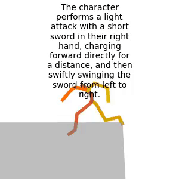
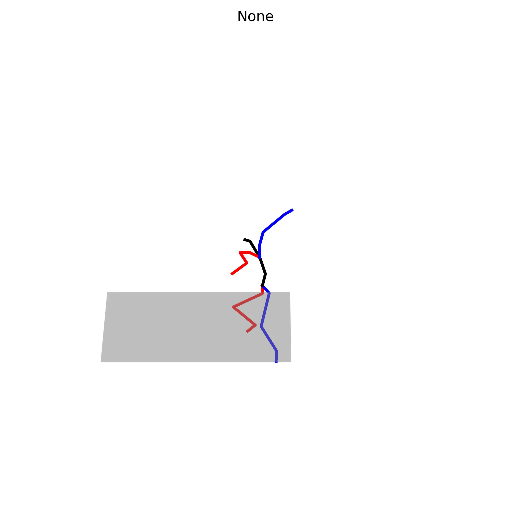
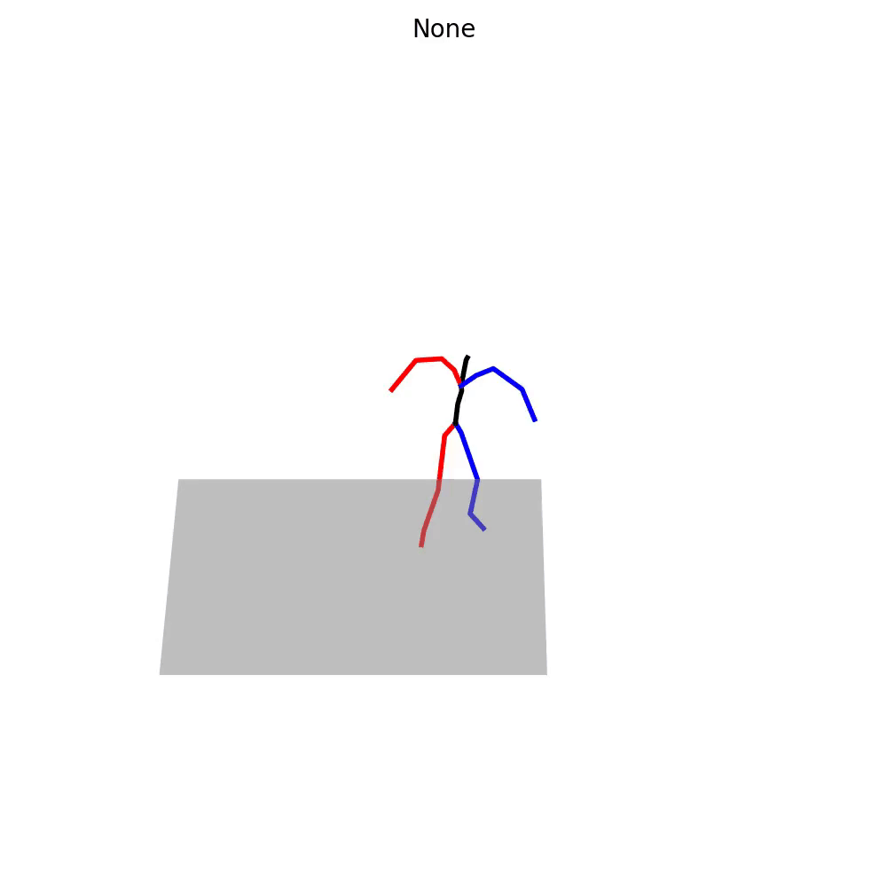
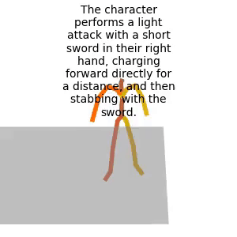
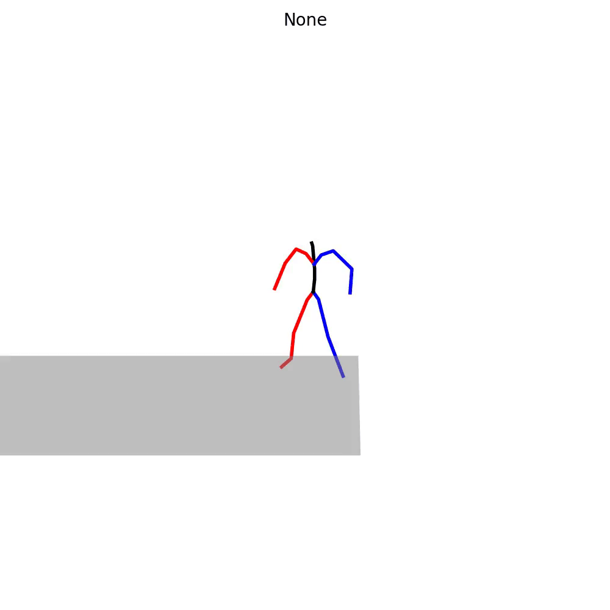
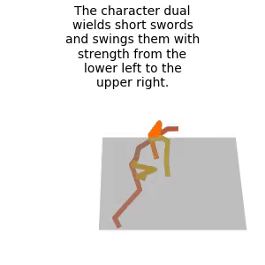
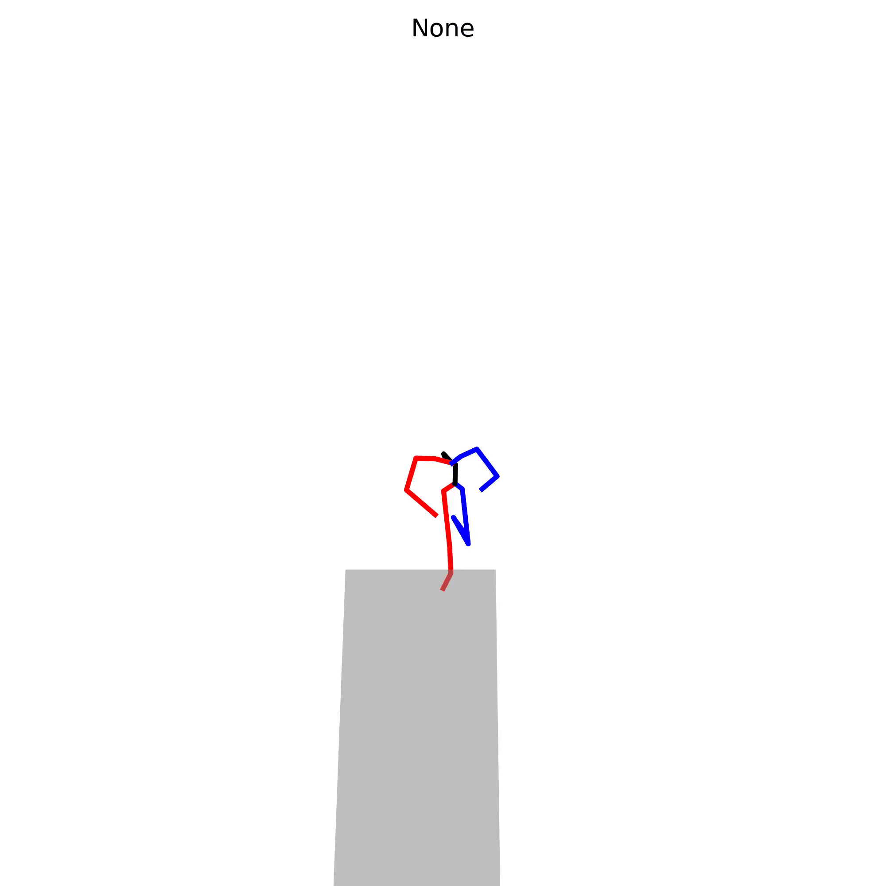
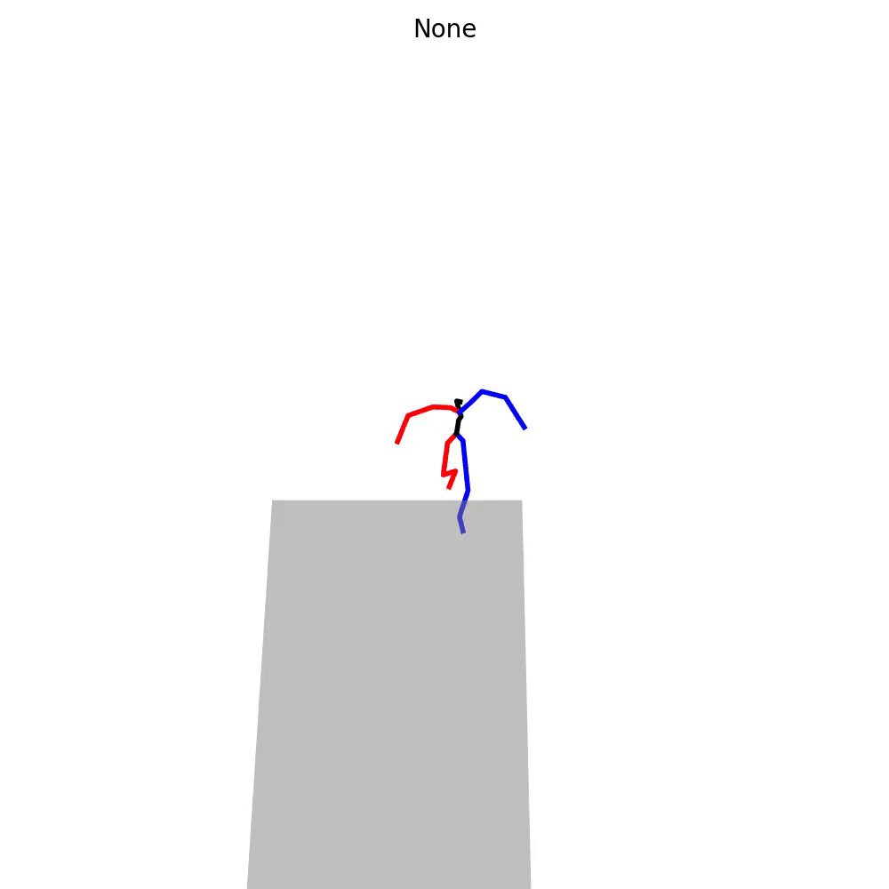

# 
animationGPT

 
Character animation generation based on text-to-motion and large models

## Dataset

Pipline：[HumanML3D](https://github.com/EricGuo5513/HumanML3D)

| Version      | Size                          | Notes                                                        |
| ------------ | ----------------------------- | ------------------------------------------------------------ |
| soul_v1(old) | 30368(with mirror) 15473 | 1. 删除了镜像npy（mirror）后文件数是15473； 2. 注意：Mean.npy和Std.npy的计算不包括镜像文件 |
| soul_v2      | 14993                         | 1. shinnobi和grappling缺失词性标注导致模型训练崩溃。         |
| soul_v3      | 11662                         | 1. 部分标注异常，例如“The character performs the '忍义手' pose ”； 2. 多个标注内容相同（GPT标注问题）。 |
| soul_v4      |                               | Todo                                                         |

### soul_v2

| 动画ID      | 是否可用 | 动作类型 | 武器名 | 武器类型 | 攻击类型 | 方位词   | 力量感描述词 | 速度感描述词  | 模糊描述词          |
| ----------- | -------- | -------- | ------ | -------- | -------- | -------- | ------------ | ------------- | ------------------- |
| a000_000000 | 是       | Idle     |        |          |          | In-Place | Steady       | Uniform Speed | Relaxing            |
| a000_000001 | 是       | Idle     |        |          |          | In-Place | Steady       | Uniform Speed | Nervous             |
| a000_000110 | 否       |          |        |          |          |          |              |               |                     |
| a000_000112 | 否       |          |        |          |          |          |              |               |                     |
| a000_000113 | 否       |          |        |          |          |          |              |               |                     |
| a000_000114 | 否       |          |        |          |          |          |              |               |                     |
| a000_000115 | 否       |          |        |          |          |          |              |               |                     |
| a000_001000 | 是       | Idle     |        |          |          | In-Place | Steady       | Uniform Speed | Smooth and Coherent |
| a000_001001 | 是       | Idle     |        |          |          | In-Place | Powerless    | Relative Slow | Smooth and Coherent |
| a000_001100 | 是       | Idle     |        |          |          | In-Place | Steady       | Relative Fast | Smooth and Coherent |

### soul_v3

部分标注示例：

| ID           | Desc_CN                                                    | Desc_EN                                                      |
| ------------ | ---------------------------------------------------------- | ------------------------------------------------------------ |
| ER000_004070 | 角色无力地挣扎，双臂全身前倾倒下。                         | The character struggles weakly, with both arms leaning forward and  falling down. |
| ER000_004080 | 角色轻盈地收拢双臂向中间，上半身从后仰恢复直立。           | The character delicately gathers both arms towards the center, and the  upper body straightens up from a leaning position. |
| ER000_004230 | 角色略微屈膝姿势，快速起身直立。                           | The character slightly bends their knees and quickly stands up straight. |
| ER000_004240 | 角色半蹲姿势，逐渐起身直立。                               | The character gradually stands up from a half-squatting position. |
| ER000_004250 | 角色半跪姿势，缓慢起身直立。                               | The character slowly stands up from a half-kneeling position. |
| ER000_000000 | 角色以空手待机姿势站立静止不动。                           | The character stands still in a neutral stance with empty hands. |
| ER000_000030 | 角色以双手握持物品的姿势站立静止不动。                     | The character stands still in a stance with both hands holding an item. |
| ER000_000100 | 角色以扎实的姿势侧身半蹲，左手举起在身前，保持紧张的状态。 | The character takes a solid stance, half squatting and holding their left  hand up in front of them, maintaining a tense state. |
| ER000_000101 | 角色以轻盈的姿势马步站立，双脚同时后跳，动作流畅连贯。     | The character stands in a light and agile stance, jumping back with both  feet at the same time, performing a smooth and fluid movement. |
| ER000_000110 | 角色以马步姿势站立，左手紧张地垂放在胸前。                 | The character stands in a stance with one foot forward and one foot back,  with their left hand tensely hanging in front of their chest. |

## Experiment and Animation

### soul_v3

#### animations

|                           MDM                            |                             MLD                              |                             mGPT                             |
| :------------------------------------------------------: | :----------------------------------------------------------: | :----------------------------------------------------------: |
|  |  |  |
|  |  |  |
|  |  |  |

#### evaluate

| **Metric**                                             | **MDM**           | **MLD**           | **mGPT**          |
| ------------------------------------------------------ | ----------------- | ----------------- | ----------------- |
| **Matching  Score↓**                                   | **5.5293±0.0030** | 5.8812±0.0098     | 6.1470±0.0140     |
| **Matching  Score (vald)↓** **(gt for MLD/mGPT)** | 5.9708±0.0180     | 5.5263±0.0038     | 5.5185±0.0043     |
| **R_precision**  **(top 1)↑**                          | **0.0925±0.0024** | 0.0799±0.0025     | 0.0668±0.0018     |
| **R_precision**  **(top 2)↑**                          | **0.1595±0.0022** | 0.1397±0.0027     | 0.1250±0.0031     |
| **R_precision**  **(top 3)↑**                          | **0.2136±0.0025** | 0.1937±0.0026     | 0.1730±0.0031     |
| **R_precision** **(gt top 1)↑**                        | -                 | 0.0935±0.0017     | 0.0929±0.0019     |
| **R_precision  (gt top 2)↑**                           | -                 | 0.1549±0.0029     | 0.1586±0.0023     |
| **R_precision** **(gt top 3)↑**                        | -                 | 0.2128±0.0035     | 0.2130±0.0029     |
| **FID↓**                                               | 0.0147±0.0004     | 1.0979±0.0337     | 1.3792±0.0498     |
| **Diversity→**                                         | 5.6927±0.0331     | **5.7232±0.0613** | 5.7904±0.0510     |
| **Diversity  (vald)→  (gt for MLD/mGPT)**         | 5.8120±0.0555     | 5.8062±0.0386     | 5.6903±0.0740     |
| **MultiModality ↑**                                    | None              | 1.9912±0.0469     | **3.6207±0.0872** |
