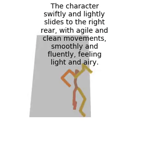
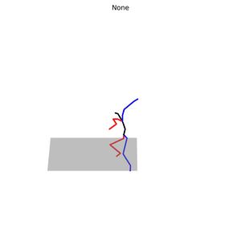
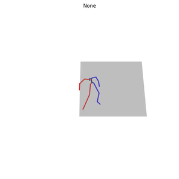
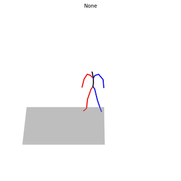
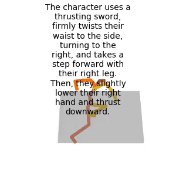
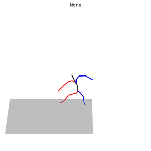
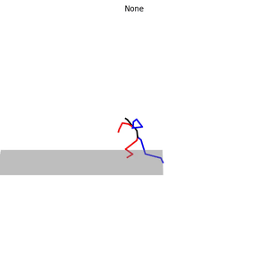
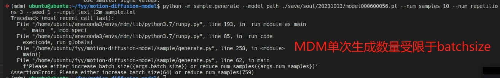

# animationResult

## soul_v3

|                          MDM                           |                             MLD                              |                   mGPT                   |
| :----------------------------------------------------: | :----------------------------------------------------------: | :--------------------------------------: |
|  |  |    |
|              |  |  |
|              |  |  |

evaluation


| **Metric**                                     | **MDM**           | **MLD**           | **mGPT**          |
| ---------------------------------------------- | ----------------- | ----------------- | ----------------- |
| Matching  Score↓                               | **5.5293±0.0030** | 5.8812±0.0098     | 6.1470±0.0140     |
| Matching  Score (vald)↓<br />(gt for MLD/mGPT) | 5.9708±0.0180     | 5.5263±0.0038     | **5.5185±0.0043** |
| R_precision  (top 1)↑                          | **0.0925±0.0024** | 0.0799±0.0025     | 0.0668±0.0018     |
| R_precision  (top 2)↑                          | **0.1595±0.0022** | 0.1397±0.0027     | 0.1250±0.0031     |
| R_precision  (top 3)↑                          | **0.2136±0.0025** | 0.1937±0.0026     | 0.1730±0.0031     |
| R_precision (gt top 1)↑                        | 0.0778±0.0031     | **0.0935±0.0017** | 0.0929±0.0019     |
| R_precision  (gt top 2)↑                       | 0.1418±0.0040     | 0.1549±0.0029     | **0.1586±0.0023** |
| R_precision (gt top 3)↑                        | 0.1958±0.0050     | 0.2128±0.0035     | **0.2130±0.0029** |
| FID↓                                           | **0.8895±0.0369** | 1.0979±0.0337     | 1.3792±0.0498     |
| Diversity→                                     | 5.6927±0.0331     | **5.7232±0.0613** | 5.7904±0.0510     |
| Diversity  (vald)→ <br />(gt for MLD/mGPT)     | 5.8120±0.0555     | **5.8062±0.0386** | 5.6903±0.0740     |
| MultiModality ↑                                | None              | 1.9912±0.0469     | **3.6207±0.0872** |

综合上述指标，MDM在条件匹配程度上表现较好，MLD在生成质量上表现较好，mGPT在生成多样性上表现较好。


# t2m_Prompt注意事项

批量实现text2motion，需要将prompt保存到txt文件中，但需要注意不同项目之间的区别：

MDM的单次生成和采样数量受限于batchsize



MLD需要在文本指令前加上期望的帧数

```python
with open("MLD_t2m_soul_v3.txt", "r",encoding='utf-8') as f:
    lines = f.readlines()
    newlines = []
    for line in lines:
    # 固定帧数为100
        newlines.append(str(100)+" "+line)

    with open("t2msoulv3.txt", "w") as f:
        f.writelines(newlines)
```

