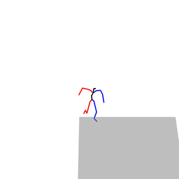
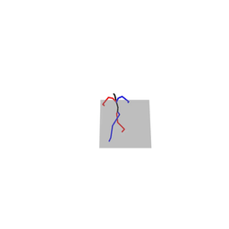
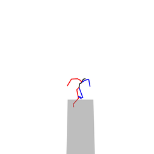
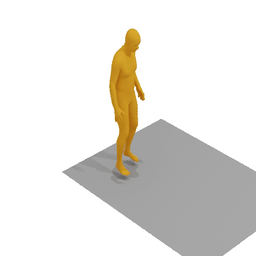
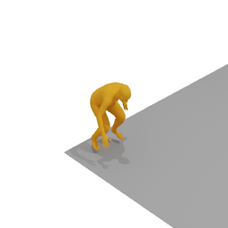
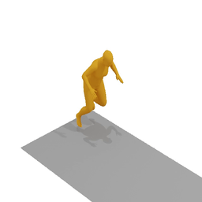
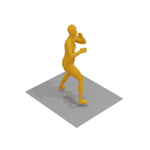
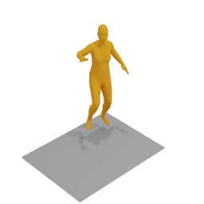
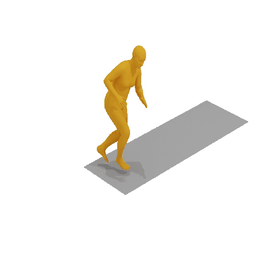

# animationResult

How to use?

- matplotlib==3.3.3
- `mGPT_npy_Rename.py`用于给mGPT输出的out.npy文件重命名，保证和采样excel中要求的名称一致。和`animationWithTitle.py`配套使用。


## soul_v3

|                          MDM                           |                             MLD                              |                   mGPT                   |
| :----------------------------------------------------: | :----------------------------------------------------------: | :--------------------------------------: |
|  |  |    |
|              |  |  |
|              |  |  |

evaluation


| **Metric**                                     | **MDM**           | **MLD**           | **mGPT**          |
| ---------------------------------------------- | ----------------- | ----------------- | ----------------- |
| Matching  Score↓                               | **5.5293±0.0030** | 5.8812±0.0098     | 6.1470±0.0140     |
| Matching  Score (vald)↓<br />(gt for MLD/mGPT) | 5.9708±0.0180     | 5.5263±0.0038     | **5.5185±0.0043** |
| R_precision  (top 1)↑                          | **0.0925±0.0024** | 0.0799±0.0025     | 0.0668±0.0018     |
| R_precision  (top 2)↑                          | **0.1595±0.0022** | 0.1397±0.0027     | 0.1250±0.0031     |
| R_precision  (top 3)↑                          | **0.2136±0.0025** | 0.1937±0.0026     | 0.1730±0.0031     |
| R_precision (gt top 1)↑                        | 0.0778±0.0031     | **0.0935±0.0017** | 0.0929±0.0019     |
| R_precision  (gt top 2)↑                       | 0.1418±0.0040     | 0.1549±0.0029     | **0.1586±0.0023** |
| R_precision (gt top 3)↑                        | 0.1958±0.0050     | 0.2128±0.0035     | **0.2130±0.0029** |
| FID↓                                           | **0.8895±0.0369** | 1.0979±0.0337     | 1.3792±0.0498     |
| Diversity→                                     | 5.6927±0.0331     | **5.7232±0.0613** | 5.7904±0.0510     |
| Diversity  (vald)→ <br />(gt for MLD/mGPT)     | 5.8120±0.0555     | **5.8062±0.0386** | 5.6903±0.0740     |
| MultiModality ↑                                | None              | 1.9912±0.0469     | **3.6207±0.0872** |

综合上述指标，MDM在条件匹配程度上表现较好，MLD在生成质量上表现较好，mGPT在生成多样性上表现较好。

## HSmerge

|                    MDM                     |                             MLD                              |                   mGPT                   |
| :----------------------------------------: | :----------------------------------------------------------: | :--------------------------------------: |
|  |  |  |
|                    同上                    |  |  |
|                    同上                    |  |  |

- MDM训练崩溃
- MLD的foot slide问题比较明显

**Render on SMPL(mGPT)**

|    |    |  |
| :------------------------------------------------: | :------------------------------------------------: | :------------------------------------------------: |
|  |  |  |


**evaluation**

| **Metric**                                     |      **MDM**      |      **MLD**      |     **mGPT**      |
| :--------------------------------------------- | :---------------: | :---------------: | :---------------: |
| Matching  Score↓                               | **3.5627±0.0058** |   4.4489±0.0114   |   6.1315±0.0182   |
| Matching  Score (vald)↓<br />(gt for MLD/mGPT) |   9.6946±0.0370   |   3.5756±0.0058   | **3.5719±0.0056** |
| R_precision  (top 1)↑                          | **0.4499±0.0022** |   0.3276±0.0029   |   0.1825±0.0028   |
| R_precision  (top 2)↑                          | **0.5892±0.0020** |   0.4664±0.0028   |   0.2781±0.0034   |
| R_precision  (top 3)↑                          | **0.6614±0.0018** |   0.5521±0.0024   |   0.3452±0.0033   |
| R_precision (gt top 1)↑                        |   0.0343±0.0021   | **0.4478±0.0027** |   0.4466±0.0031   |
| R_precision  (gt top 2)↑                       |   0.0679±0.0021   |   0.5869±0.0016   | **0.5879±0.0024** |
| R_precision (gt top 3)↑                        |   0.0991±0.0028   | **0.6616±0.0018** |   0.6612±0.0020   |
| FID↓                                           |  63.0029±0.0369   |   1.5230±0.0333   | **0.9084±0.0255** |
| Diversity→                                     |   8.5696±0.0770   | **8.4380±0.1039** |   8.3893±0.0752   |
| Diversity  (vald)→ <br />(gt for MLD/mGPT)     |   0.6601±0.0156   | **8.5630±0.0656** |   8.5648±0.0603   |
| MultiModality ↑                                |       None        | **2.5846±0.0875** |   5.8888±0.1620   |

和soul_v3的评估结果相比，混合训练在各指标上都有明显的提升，这得益于数据集的扩充。

## Finetune-H+S3

| Metric                                   | mGPT          |
| ---------------------------------------- | ------------- |
| Matching Score↓                          | 6.1942±0.0127 |
| Matching Score (vald)↓ (gt for MLD/mGPT) | 5.5185±0.0043 |
| R_precision (top 1)↑                     | 0.0364±0.0018 |
| R_precision (top 2)↑                     | 0.0697±0.0029 |
| R_precision (top 3)↑                     | 0.1043±0.0037 |
| R_precision (gt top 1)↑                  | 0.0929±0.0019 |
| R_precision (gt top 2)↑                  | 0.1586±0.0023 |
| R_precision (gt top 3)↑                  | 0.2130±0.0029 |
| FID↓                                     | 1.9095±0.0342 |
| Diversity→                               | 4.6923±0.0325 |
| Diversity (vald)→ (gt for MLD/mGPT)      | 5.6903±0.0740 |
| MultiModality ↑                          | 2.9249±0.0914 |

**从评估指标来看，效果明显变差。**


# t2m_Prompt注意事项

批量实现text2motion，需要将prompt保存到txt文件中，但需要注意不同项目之间的区别：

MDM的单次生成和采样数量受限于batchsize


MLD需要在文本指令前加上期望的帧数

```python
with open("MLD_t2m_soul_v3.txt", "r",encoding='utf-8') as f:
    lines = f.readlines()
    newlines = []
    for line in lines:
    # 固定帧数为100
        newlines.append(str(100)+" "+line)

    with open("t2msoulv3.txt", "w") as f:
        f.writelines(newlines)
```

