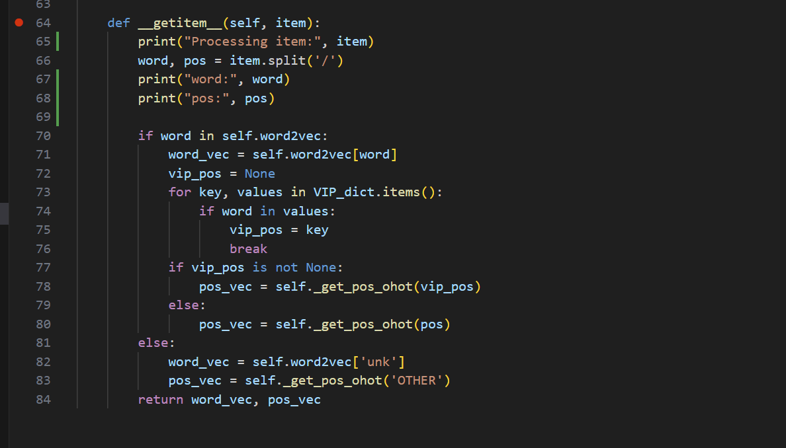

# soul

数据来源：魂系动画

制作流程：[HumanML3D](https://github.com/EricGuo5513/HumanML3D)

## soul_v1

也就是最初的old文件。删除了mirror文件和[NaN文件](https://github.com/GuyTevet/motion-diffusion-model/issues/110)。

## soul_v2

**标注**

| 动画ID      | 是否可用 | 动作类型 | 武器名 | 武器类型 | 攻击类型 | 方位词   | 力量感描述词 | 速度感描述词  | 模糊描述词          |
| ----------- | -------- | -------- | ------ | -------- | -------- | -------- | ------------ | ------------- | ------------------- |
| a000_000000 | 是       | Idle     |        |          |          | In-Place | Steady       | Uniform Speed | Relaxing            |
| a000_000001 | 是       | Idle     |        |          |          | In-Place | Steady       | Uniform Speed | Nervous             |
| a000_000110 | 否       |          |        |          |          |          |              |               |                     |
| a000_000112 | 否       |          |        |          |          |          |              |               |                     |
| a000_000113 | 否       |          |        |          |          |          |              |               |                     |
| a000_000114 | 否       |          |        |          |          |          |              |               |                     |
| a000_000115 | 否       |          |        |          |          |          |              |               |                     |
| a000_001000 | 是       | Idle     |        |          |          | In-Place | Steady       | Uniform Speed | Smooth and Coherent |
| a000_001001 | 是       | Idle     |        |          |          | In-Place | Powerless    | Relative Slow | Smooth and Coherent |
| a000_001100 | 是       | Idle     |        |          |          | In-Place | Steady       | Relative Fast | Smooth and Coherent |

**数据集存在问题**

1. **数据读取问题**

   ```
   ValueError: Caught ValueError in DataLoader worker process 1.
   ```

   **处理方法：**设置num_works=0

2. **词性标注问题**

   FID的计算会导致训练崩溃

   ```
     File "/root/autodl-tmp/motion-latent-diffusion/mld/models/metrics/tm2t.py", line 147, in compute
       metrics["FID"] = calculate_frechet_distance_np(gt_mu, gt_cov, mu, cov)
     File "/root/autodl-tmp/motion-latent-diffusion/mld/models/metrics/utils.py", line 205, in calculate_frechet_distance_np
       raise ValueError("Imaginary component {}".format(m))
   ValueError: Imaginary component 34786744.5361432
   ```

   ```
   line 66, in __getitem__
       word, pos = item.split('/')
   ValueError: not enough values to unpack (expected 2, got 1)
   ```

   

   **错误原因：**shinnobi和grappling缺少词性标注。以shinnobi为例：

   ```
   shinnobi prosthetic finger whistle left-handed charged heavy attack in-place light-weighted straightforward uniform speed smooth and coherent relaxing squatting position the left hand on the mouth the body to the right behind the body is turned towards the front whistle resume the squatting position #shinnobi prosthetic/ADJ finger/NOUN whistle/NOUN left/ADV -/PUNCT handed/ADJ charged/VERB heavy/ADJ attack/NOUN in/ADP -/PUNCT place/NOUN light/NOUN -/PUNCT weighted/ADJ straightforward/ADJ uniform/ADJ speed/NOUN smooth/ADJ and/CCONJ coherent/ADJ relaxing/VERB squatting/VERB position/NOUN  the/DET left/ADJ hand/NOUN on/ADP the/DET mouth/NOUN  the/DET body/NOUN to/ADP the/DET right/NOUN behind/ADP the/DET body/NOUN is/AUX turned/VERB towards/ADP the/DET front/ADJ whistle/NOUN  resume/VERB the/DET squatting/NOUN position/NOUN #0.0#0.0
   ```

   **处理方法：**删除全部含有`shinnobi`和`grappling`数据。


## soul_v3

**标注**

| ID           | Desc_CN                                                    | Desc_EN                                                      |
| ------------ | ---------------------------------------------------------- | ------------------------------------------------------------ |
| ER000_004070 | 角色无力地挣扎，双臂全身前倾倒下。                         | The character struggles weakly, with both arms leaning forward and  falling down. |
| ER000_004080 | 角色轻盈地收拢双臂向中间，上半身从后仰恢复直立。           | The character delicately gathers both arms towards the center, and the  upper body straightens up from a leaning position. |
| ER000_004230 | 角色略微屈膝姿势，快速起身直立。                           | The character slightly bends their knees and quickly stands up straight. |
| ER000_004240 | 角色半蹲姿势，逐渐起身直立。                               | The character gradually stands up from a half-squatting position. |
| ER000_004250 | 角色半跪姿势，缓慢起身直立。                               | The character slowly stands up from a half-kneeling position. |
| ER000_000000 | 角色以空手待机姿势站立静止不动。                           | The character stands still in a neutral stance with empty hands. |
| ER000_000030 | 角色以双手握持物品的姿势站立静止不动。                     | The character stands still in a stance with both hands holding an item. |
| ER000_000100 | 角色以扎实的姿势侧身半蹲，左手举起在身前，保持紧张的状态。 | The character takes a solid stance, half squatting and holding their left  hand up in front of them, maintaining a tense state. |
| ER000_000101 | 角色以轻盈的姿势马步站立，双脚同时后跳，动作流畅连贯。     | The character stands in a light and agile stance, jumping back with both  feet at the same time, performing a smooth and fluid movement. |
| ER000_000110 | 角色以马步姿势站立，左手紧张地垂放在胸前。                 | The character stands in a stance with one foot forward and one foot back,  with their left hand tensely hanging in front of their chest. |

**数据集存在问题**

1. **文本标注有重复的情况：**5个重复（12）、4个重复（19）、3个重复（153）、2个重复（863）；

   其实这不算是太大的问题，因为占比很少的重复数据对模型的影响并不大。类似的，HumanML3D中也有很多重复的数据，例如走路、跑步这类常见的动作。

2. 根据采样标注寻找原始的motion.npy（需求759个，目前找到746个），以下几个**数据缺失**：

   ```
   BB129_052160
   ER032_032400
   ER032_032500
   ER342_090103
   ER032_032501
   ER032_032620
   ER032_032300
   ER032_032210
   BB129_052165
   BB000_004110
   BB129_052163
   BB129_052162
   ER032_032621
   ```

   处理：已删除，此后使用746采样版本。

3. **动作类型有偏。**动作类游戏当中的动画风格相对来说是集中的。

## soul_v4

***todo***

繁简双标注

- “一个人蓄力重击挥出大剑。”
- “一个人扎马步，左脚为轴，右脚发力向前，双臂随着腰向前蓄力挥动大剑。”

